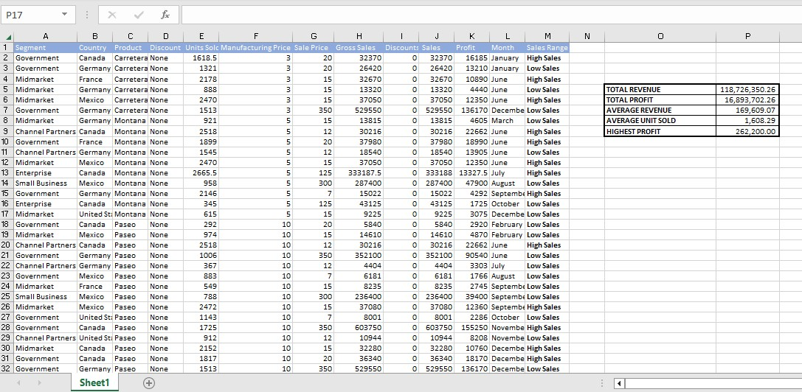

# First-set-of-excel-tasks
## GENERAL DESCRIPTION OF ALL TASKS
Three tasks were assigned within the first week of the Data Analysis Cohort course by Promise Nonso. They were designed to help participants to develop proficiency in Data Manipulation, using Microsoft Excel.
## TASK 1
Create a table of information that consists of 20 rows and 5 columns that will include the following information details: Employee ID, Employee Full Name, Department, Salary and Job Type. Make 3 identical sheets of the spreadsheet on the same Excel document and manipulate the data on the sheets as detailed in Tasks 1,2 and 3 below:
Task_1.xlsx
### In worksheet 1
Show only employees who are ‘Freelancers’ and highlight the ones whose salaries are above $10,000

### In worksheet 2 
Split the employees’ full names into First Name and Last Name. Check for duplicates and highlight if any (do not delete)

### In worksheet 3 
Highlight employees whose names begin with the letter ‘E’ (in yellow). Format the Salary column such that the highest SALARY has a green back-ground and the lowest SALARY has a red background.

### Skills Demonstrated
1. Data Manipulation
2. Use of Conditional Formatting
3. Use of Filters
4. Text-to-Column

## TASK 2
Using a relatively large Sales Data-set, calculate the Sum and Average of Profit, Sales and Units Sold
Get the highest and lowest Profit values
Create a new column bearing just the first two letters of the Countries
If the Profit is above average, return ‘High’, otherwise ‘Low’
Get the number of records in this data
Task_2.xlsx

### Skills Demonstrated
Data Manipulation using:
1.  Max and Min Functions
2.  Left and Right Command
3.  IF Commands
## TASK 3
Using the same relatively large Sales Data-set in Task 2, demonstrate proficiency in Data manipulation as follows
Find the Average Revenue generated from each sale of ‘Paseo’
Determine the number of sales made in the Government and Midmarket segment
The total revenue generated from the sales of ‘Montana’ in Canada
In which Country, Segment and Month was the highest unit of goods sold?
Total profit made in December
### Skills Demonstrated
Data Manipulation using:
1. AVERAGEIF Functions
2. COUNTIF Functions
3. SUMIFS Functions
4. MAX Functions
5. VLOOKUP Function
Task_3.xlsx

## CONCLUSION
Altogether it was a Positive, Interesting and Rewarding experience as i was able to Analyse data-sets after manipulation, by using various functions, commands and technics on MSExcel. I also set up my Github account.
## Thank you
